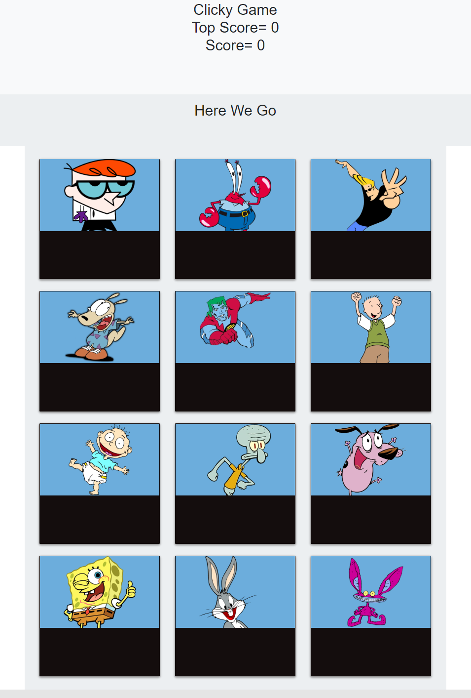
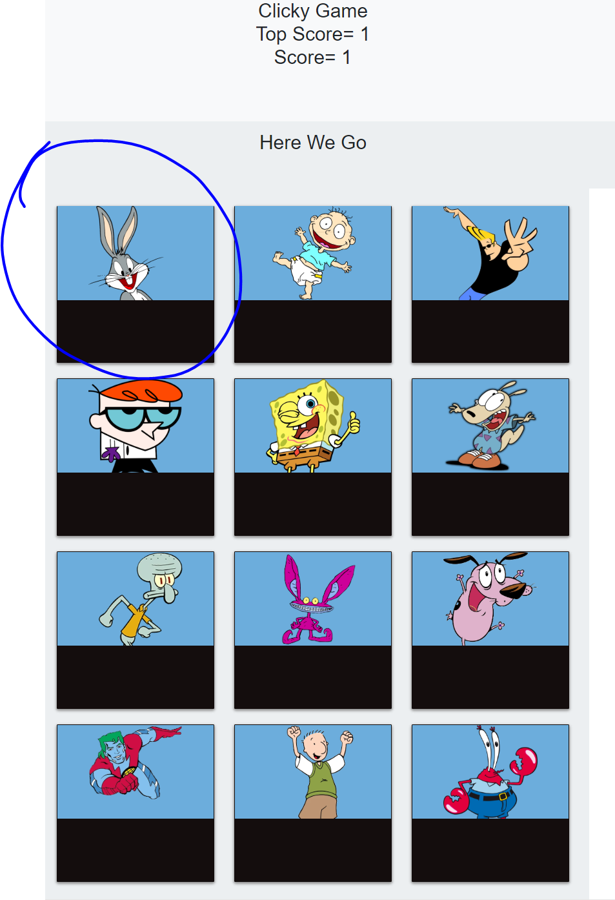
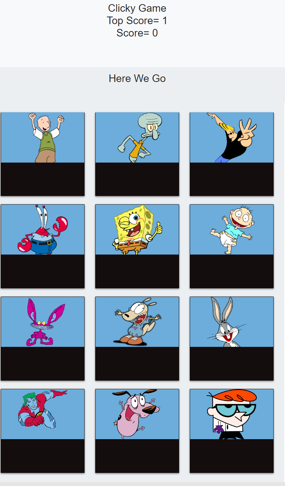

# A Clicky Game
***
# Overview:

## Clicking on an image will shuffle the images. Your score increments every time an image is clicked. If the same image is clicked more than once the game resets.

[Link to App](https://josemenis.github.io/Clicky-Game/)
---
# How it works:

## The application renders different images (of your choice) to the screen. Each image listens for click events.

## The application keeps track of the user's score. The user's score is incremented when clicking an image for the first time. The user's score is reset to 0 if they click the same image more than once.

## Every time an image is clicked, the images rendered to the page should shuffle themselves in a random order.

## Once the user's score is reset after an incorrect guess, the game should restart.

